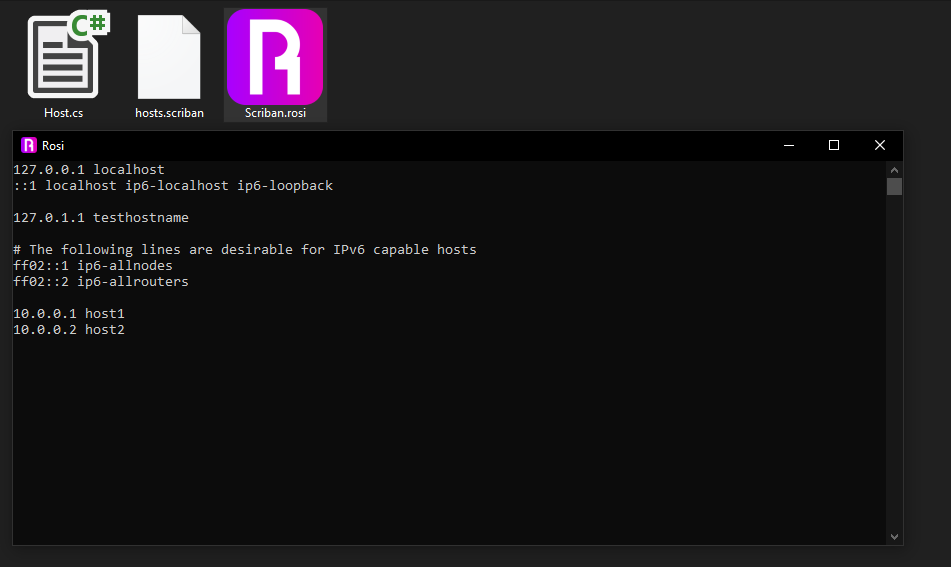
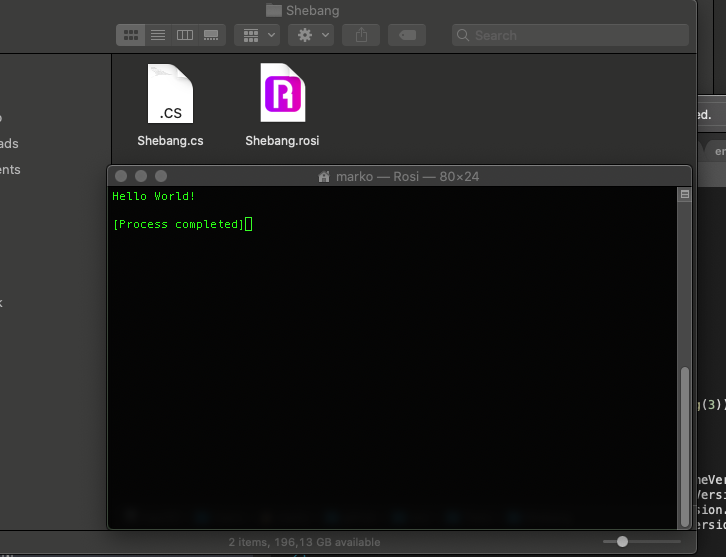

# Rosi

**The power of .NET Core in a single executable**

[](https://github.com/MarkoBL/Rosi/releases)
[](https://www.nuget.org/packages/Rosi.Runtime/)
[](https://github.com/MarkoBL/Rosi/actions)

**Rosi** is an easy way to run your C# code everywhere, especially on Linux and macOS. No need to mess around with package management. **Rosi** is just a single executable file that you need to run your C# code. Just put it on your USB drive and you're done.

> Side note: We use **Rosi** on desktop computers for automation to help the users get their stuff done faster (generate reports, process Excel sheets, etc). We usually put all the script files into a readonly network share and the users just have to double click on the correct `.rosi` file. No need to build and deploy binary files to individual computers (what a nightmare), it is 100% independent from the users operating system and we still get the native speed of the .NET Core framework. We only replace the script files on the network share and we're done.


You only have to modify your code to impelement the `IRosi` or `IAsyncRosi` and you're done.

```Csharp
using System;

public class Rosi : IRosi
{
    public int Run(IRuntime runtime)
    {
        Console.WriteLine("Hello World");
        return 0;
    }
}
```

```
> rosi HelloWord.cs
Hello World!
```

> Side note: We use [SaltStack](https://www.saltstack.com/) to manage our servers and the servers from our customers. It is a great and simple way to automate the management of our infrastructure. And therefore we have some rules, two of them are: We don't configure anything by hand, everything is done by using salt and we don't touch the package management of a system and add any external sources, if it's not really required. Using salt only is often not enough, we have to write scripts here and there to glue everything together. And we used [Bash](https://en.wikipedia.org/wiki/Bash_(Unix_shell)) scripts. But while you can writing complex scripts in bash, you usually don't want to do that.

> We thought about using a real programming language with good debugging support that runs on all important operating systems and we decided to use C# (seriously, it's a great language, static typed languages ftw!). But installing the .NET Core runtime on every system is a little overkill for running small scripts and didn't play nice with our own rules. **Rosi** was the solution to this problem.

## Install

### Linux

*Terminal*

Download, unzip and test the latest **Rosi** release.
```
> wget https://github.com/MarkoBL/Rosi/releases/latest/download/Rosi_Linux_x64.zip
or
> curl -LO https://github.com/MarkoBL/Rosi/releases/latest/download/Rosi_Linux_x64.zip
> unzip Rosi_Linux_x64.zip
> ./rosi --version
```

Make it available for every user through the terminal by putting it into `/usr/local/rosi` and put a symlink into `/usr/local/bin`
```
> sudo mkdir /usr/local/rosi
> sudo mv rosi /usr/local/rosi/
> sudo ln -s /usr/local/rosi/rosi /usr/local/bin/rosi
> rosi --version
```

*SaltStack*

This **[salt](https://www.saltstack.com/)** state installs or updates to the latest **Rosi** version.

`rosi.sls`
```Salt





 
 
  
 



install_rosi:
  archive.extracted:
    - name: {{ rosipath }}
    - source: https://github.com/MarkoBL/Rosi/releases/latest/download/Rosi_Linux_Multi_x64.zip
    - skip_verify: true
    - overwrite: true
    - enforce_toplevel: false
    - clean: true

symlink_rosi:
  file.symlink:
    - name: /usr/local/bin/rosi
    - target: {{ rosipath }}/rosi
    - requires:
      - archive: install_rosi


```

### macOS

*Terminal*

Download, unzip and test the latest **Rosi** release.
```
> wget https://github.com/MarkoBL/Rosi/releases/latest/download/Rosi_MacOs_x64.zip
or
> curl -LO https://github.com/MarkoBL/Rosi/releases/latest/download/Rosi_MacOs_x64.zip
> unzip Rosi_Linux_x64.zip
> ./rosi --version
```

Make it available for every user through the terminal by putting it into `/usr/local/rosi` and put a symlink into `/usr/local/bin`
```
> mkdir /usr/local/rosi
> mv rosi /usr/local/bin/
> ln -s /usr/local/rosi/rosi /usr/local/bin/rosi
> rosi --version
```

*App*

Download the latest [Rosi macOS App](https://github.com/MarkoBL/Rosi/releases/latest/download/Rosi_MacOs_App_x64.zip), unzip it and move it to the Applications folder. All `.rosi`files will open in the macOS App, when you double click them. To make **Rosi** available through the terminal, put a symlink into `/usr/local/bin`.

```
> ln -s /Applications/Rosi.app/Contents/Resources/rosi.bundle/rosi /usr/local/bin/rosi
```

### Windows

*Terminal*

Rosi is available via [winget](https://docs.microsoft.com/en-us/windows/package-manager/winget/):

```
> winget install rosi
```

*Installer*

Download the latest [Rosi Windows Installer](https://github.com/MarkoBL/Rosi/releases/latest/download/Rosi_Windows_x64.msi) and run it. It installs Rosi into `C:\Windows\Rosi`, adds this path to the PATH environment variable and associates the `.rosi` file extension with the `rosi.exe`.

*Manual*

Download the latest [Rosi Windows Version](https://github.com/MarkoBL/Rosi/releases/latest/download/Rosi_Windows_x64.zip) and unzip it. 
You will have the `rosi.exe` in the current directory. Move the `rosi.exe` to a location of your choice and [add to your PATH environment variable](https://medium.com/@kevinmarkvi/how-to-add-executables-to-your-path-in-windows-5ffa4ce61a53) to access it from the command line.

A more simple solution would be to move the `rosi.exe` into your Windows directory. Move it to `C:\Windows` and you're done. You can use it from the command line now. 

Associate the `.rosi` file extension with **Rosi**. Look at this [tutorial](https://www.digitaltrends.com/computing/how-to-change-file-associations/) and select the *rosi.exe* in the last step.

## Running 

### Command Line
*(Linux/macOS/Windows)* You can run **Rosi** scripts from the command line.

`helloworld.rosi`
```Csharp
public class HelloWorld : IRosi
{
    public int Run(IRuntime runtime)
    {
        Console.WriteLine("Hello World!");
        return 0;
    }
}
```
```
> rosi helloworld.rosi
Hello World!
```


### Shebang
*(Linux/macOS)* **Rosi** scripts have shebang support. But a shebang is invalid C# code and would break debugging. 
Therefore, we use a workaround for debugging scripts. We create two files, a `script.rosi` and a `script.cs` file.
The script `script.rosi` contains only the shebang and other directives and includes `script.cs`. See the [Shebang Example](Tests/Shebang).

`script.rosi`
```Csharp
#!/usr/local/bin/rosi 
// include: script.cs
```

`script.cs`
```Csharp
public class Shebang : IRosi
{
    public int Run(IRuntime runtime)
    {
        Console.WriteLine("Hello World!");
        return 0;
    }
}
```

```
> chmod +x script.rosi
> ./script.rosi
Hello World!
```

### File Association

**Rosi** scripts have the file extension `.cs` or `.rosi` and you can associate the `.rosi` file extension with **Rosi**.
Whenever a user double clicks on a `.rosi` file, the **Rosi** executes the script. 
Do not confuse your users and name only your main script `.rosi` or change the script directory to a subfolder.

*(Windows)* You have to associate the file extension `.rosi` manually with **Rosi**. Look at this [tutorial](https://www.digitaltrends.com/computing/how-to-change-file-associations/) and select the *rosi.exe* in the last step.




*(macOS)* If you download the [Rosi macOS App](https://github.com/MarkoBL/Rosi/releases/latest/download/Rosi_MacOs_App_x64.zip), all files with a `.rosi` extension will automatically open with it.



## Debugging

Every **Rosi** script is a valid C# file. 
And we didn't want to reinvent the wheel as there is already a huge eco system for C# avaiable. 
Therefore, you can debug your **Rosi** script like a normal C# program with your favorite tools and IDEs. See the provided [Debugging Project](Debugging).

Basically, you create a new C# console project in your script directory, add the *Rosi.Runtime* NuGet package and set a valid Main method.

Create a new project in your script directory with your IDE of choice or use the console:

```
> cd YourScriptDirectory // change to your script directory
> dotnet new console // create a new console project
> dotnet add package Rosi.Runtime // add the Rosi.Runtime Nuget package
```

Now, two options are available.
A new project usually contains a Program.cs with a `Main()` method. 
You can now edit this file or delete it and add the `Main()` method to your main script. 
We usually prefer the second method. 

You can now set your breakpoints and start debugging your script with your favorite IDE.

Here's an example of a script with a `Main()` method for debugging:

```Csharp
class Script : IRosi
{
    public int Run(IRuntime runtime)
    {
        System.Console.WriteLine("Hello World!");
        return 0;
    }

    static async System.Threading.Tasks.Task<int> Main(string[] args)
    {
        return await new Rosi.Runtime(typeof(Script), args).RunAsync();
    }
}
```

## Directives

**// include:**

The include directive actually includes the content of the script file into the current script. 
This is done by splitting the script into a header and body part and insert it at the right locations in the current script.
You can specify a wildcard to include all `.rosi` and `.cs`. Use `include *` to include all files in the current directory or
`include **` to include all files in the current directory and all the subdirectories. You can also specify a directory to
include files, e.g. `include Source/**`.


```Csharp
class A
{
    readonly B _b;
    public A(B b)
    {
        _b = b;
    }

    public int Compiled()
    {
        _b.Test();
        return 0;
    }
}
```
```Csharp
// include: A
class B : IRosi
{
    public void Test()
    {
        Console.WriteLine("Test");
    }
    public int Run(IRuntime runtime)
    {
        return new A(this).Compiled();
    }
}
```

> A side note: Once we had a large script of entity definitions (a few thousand lines), with a lot of circling references (entity A was referencing entity B and vice versa). Therefore, we couldn't break them down into different assemblies. This wasn't a big problem at all for us, as all this code didn't contain much logic. But it was a huge problem for Visual Studio, as it wasn't able to process the script in a reasonable time. Sometimes it took a few secondes before it accepted a key strokes or updated intellisense. After a while (and lots of swearing), we decided to implement the *include* directive. We put all the entities in separate script files and added an empty script that simply includes all of them. Problem solved.


**// compile:**

*You should usually use the include directive.*
The compile directive compiles a script into an assembly. 
The *Rosi.Runtime* will automatically reference and include the compiled assembliy. 
The compiling happens before the actual script that contains the directive will be compiled.
If it can't find the specified file, it will add the `.rosi` extension and will try it again. If this fails too, it will add the `.cs` file extension. If all tries fail, the runtime will exit.

`A.cs`
```Csharp
class A
{
    public int Compiled()
    {
        return 0;
    }
}
```

`B.cs`
```Csharp
// compile: A // this will actually resolve to A.cs
class B : IRosi
{
    public int Run(IRuntime runtime)
    {
        return new A().Compiled();
    }
}
```

**// postcompile:**

*You should usually use the include directive.*
This acts like the compile directive, but the script will be compiled into an assembly, AFTER the script that contains it is compiled.

**// assembly:**

Loads an assembly into the *Rosi.Runtime*.

```Csharp
// assembly: Newtonsoft.Json.dll
using Newtonsoft.Json;
class Json : IRosi
{
    public int Run(IRuntime runtime)
    {
        Console.WriteLine(JsonConvert.SerializeObject(new TestObject()));
        return 0;
    }
}
```

**// set, setlinux, setmacos, setwindows or debugset:**

Sets internal or custom options. *Setlinux*, *setmacos*, *setwindows* will set this option only on the matching os. It is also possible to specify options via arguments. *Debugset* works only while debugging a script, otherwise it is ignored.

`A.cs`
```Csharp
// set: config.test Hello Config!
// setlinux: config.test Hello Config From Linux!
// set: argument.test Will be overriden by the command argument
// setdebug: runtime.logtofile 1
class A : IRosi
{
    public int Run(IRuntime runtime)
    {
        Console.WriteLine(runtime.Config.Get("config.test", string.Empty));
        Console.WriteLine(runtime.Config.Get("argument.test", string.Empty));
        return 0;
    }
}
```

```
> rosi A.cs -argument.test "Hello Argument!"
Hello Config!
Hello Argument!
```

On Linux the script would output:
```
> rosi A.cs -argument.test "Hello Argument!"
Hello Config From Linux!
Hello Argument!
```

## Options

Internal options for the *Rosi.Runtime*. You can set the options via the **set/debugset** directive or as a argument when running a script.

**runtime.scriptpath**

Sets a separate directory for the scripts, default is the location of the main script.

**runtime.assemblypath**

Sets a separate directory for assemblies, default is the location of the main script.

**runtime.usecachedassemblies**

Compiled assemblies will be chached and resued every run, as long as they scripts don't change. Default is true.

**runtime.logtoconsole**

Log output will be redirected to the console, default is true.

**runtime.consoleloglevel**

The log level for the console output. Valid values: Trace, Debug, Info, Warning, Error or Fatal. Default is Info.

**runtime.logtofile**

Log output will be redirected to a file, default is false

**runtime.fileloglevel**

The log level for the console output. Valid values: Trace, Debug, Info, Warning, Error or Fatal. Default is Warning.

**runtime.logfilename**

The name or path of the log file, default is log.txt.

**runtime.logfileappend**

Appends the log output to the current log file, otherwise the log file will be overwritten every run. Default is true.

**runtime.logscript**

Show the actual script in the log ouput, if the compilation fails.

**scriban.path**

Sets a separate directory for scriban templates, default is the location of the main script.

**rosi.waitforexit**

You will have to press a key after the exection of the script. This is useful on Windows, as the console window closes after the execution of the script. Default is false.

# Scriban Templates

[Scriban](https://github.com/lunet-io/scriban) is a fast and powerful templating engine. 
If you don't know scriban, head over the [GitHub Repository](https://github.com/lunet-io/scriban) to learn more about it. It is easy to use and really awesome.

As linux admin, you probably know, that there are text based configuration files everywhere. 
And as we often need to create configuration files, we embedded scriban into the Rosi.Runtime. 
There is an example available: [Scriban Exmaple](Tests/Scriban).

`Host.cs`
```Csharp
using System.Net;

public class Host
{
    public string Name;
    public IPAddress Address;
}
```

`Scriban.cs`
```Csharp
// compile: Host
using System;
using System.Collections.Generic;
using System.Net;

public class Scriban : IRosi
{
    public int Run(IRuntime runtime)
    {
        var scriban = runtime.Scriban;

        scriban.ImportObject("Hosts", new List<Host> {
            new Host { Name = "host1", Address = IPAddress.Parse("10.0.0.1") },
            new Host { Name = "host2", Address = IPAddress.Parse("10.0.0.2") }
        });

        var result = scriban.Render("hosts", "testhostname");
        if (result.Valid)
        {
            Console.WriteLine(result.Output);
            return 0;
        }

        return 1;
    }
}
```

`hosts.scriban`
```
{{-

$hostname = $1

$valid = (object.size $hostname) > 0

setfilename "/etc/hosts"
setvalid $valid "Hostname is missing"

if !$valid
 ret
end

-}}
127.0.0.1 localhost
::1 localhost ip6-localhost ip6-loopback

127.0.1.1 {{ $hostname }}

# The following lines are desirable for IPv6 capable hosts
ff02::1 ip6-allnodes
ff02::2 ip6-allrouters

{{ for $host in Hosts -}}
{{ $host.Address }} {{ $host.Name }}
{{ end -}}
```

```
> rosi Scriban.cs
127.0.0.1 localhost
::1 localhost ip6-localhost ip6-loopback

127.0.1.1 testhostname

# The following lines are desirable for IPv6 capable hosts
ff02::1 ip6-allnodes
ff02::2 ip6-allrouters

10.0.0.1 host1
10.0.0.2 host2
```

> Side note: We use SaltStack and Rosi to manage our and our customers clients and servers. We generate the required configurations on the local salt master with Rosi and deploy them afterwards using SaltStack. We have more control over the output and it is easier to spot and debug errors.

### In Memory of Rosi

A lovely wife, caring granda and best mom in the world.
